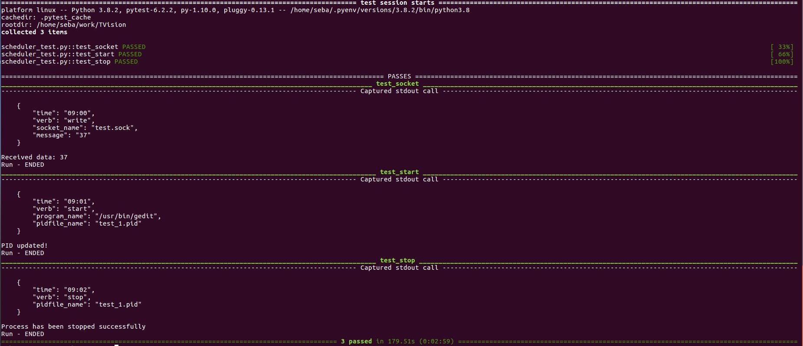

# Description:
Task scheduler that run every day at the specified time
This program will run for ever until gets cancelled.

# Tested version:
This program was tested using Python 3.8.2
Platform: Ubuntu 16.04

# Required modules:
Please run the following commands:
`pip install schedule`
`pip install psutil`

# Usage:
`scheduler.py task.json`

# Tests:
In order to test main functions like: start, stop or write, plese run the following command

`scheduler_test.py`

## Pytest execution:
Command used: ```pytest -rP -v```

Output:




# Docker Environment:
run ```./create_env.s``` to get the container ready only if all tests succeed 